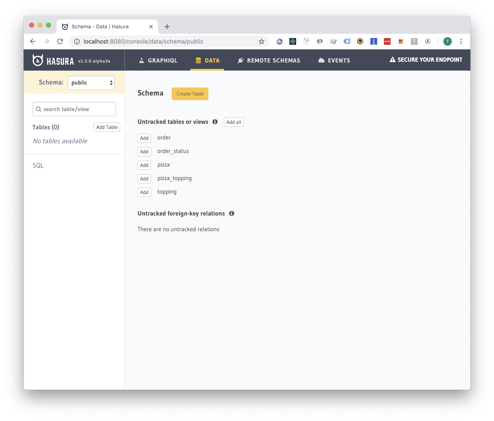
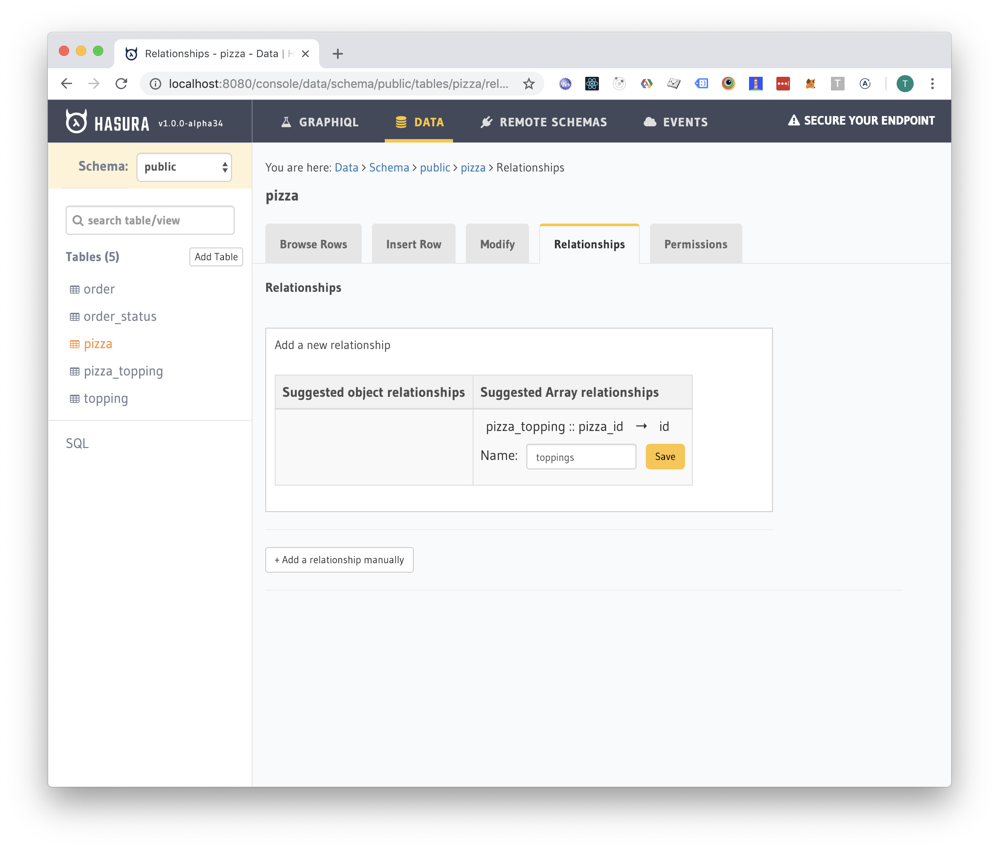
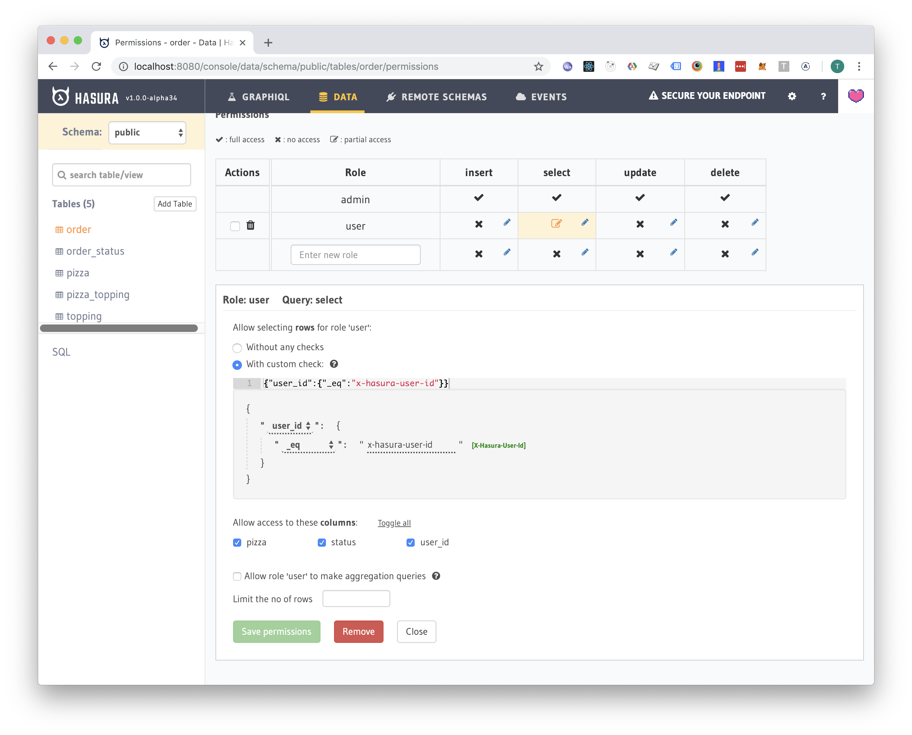
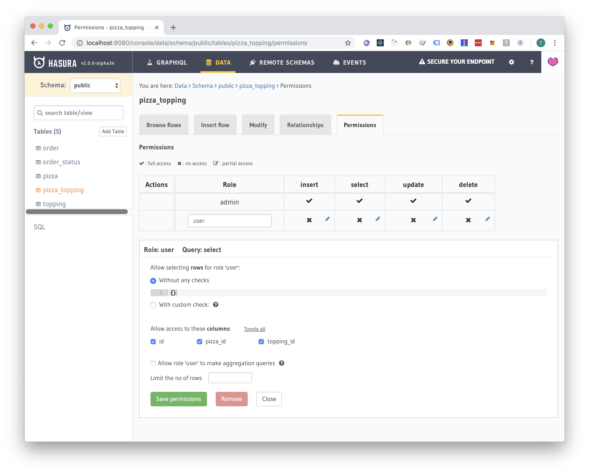
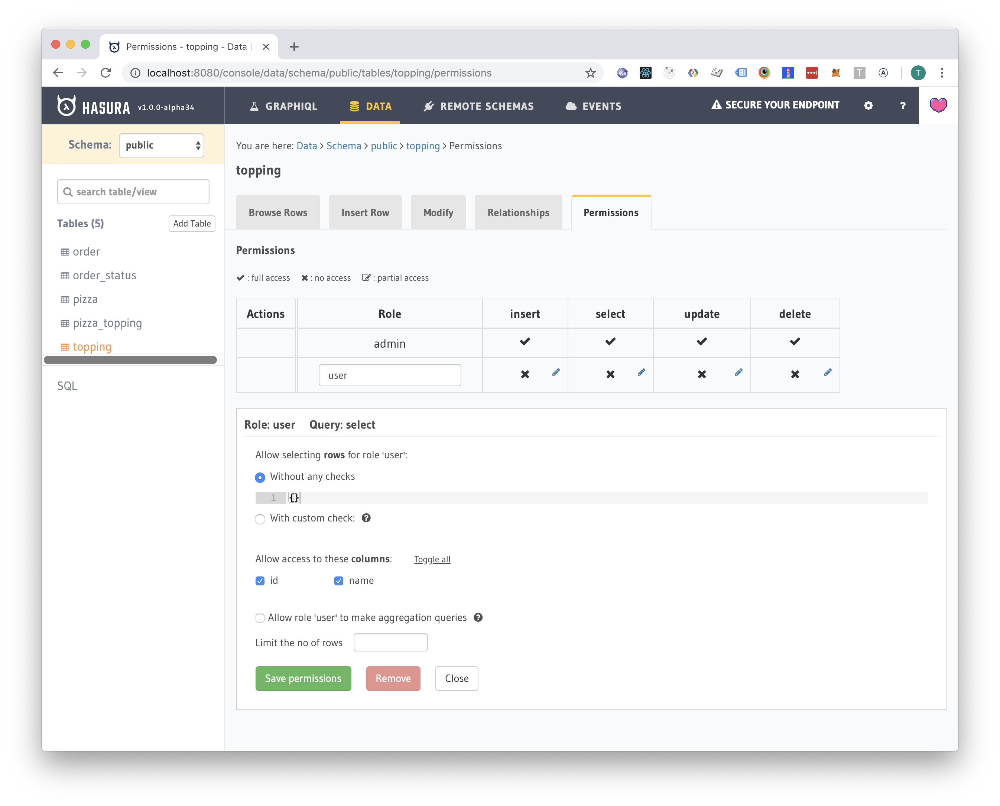
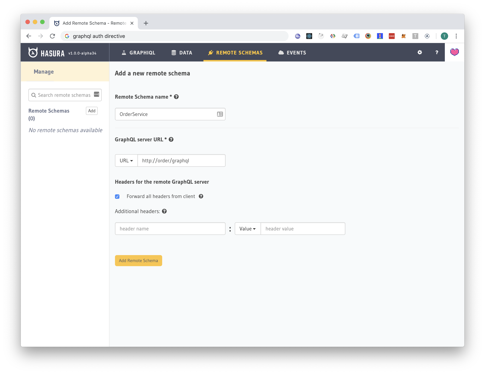
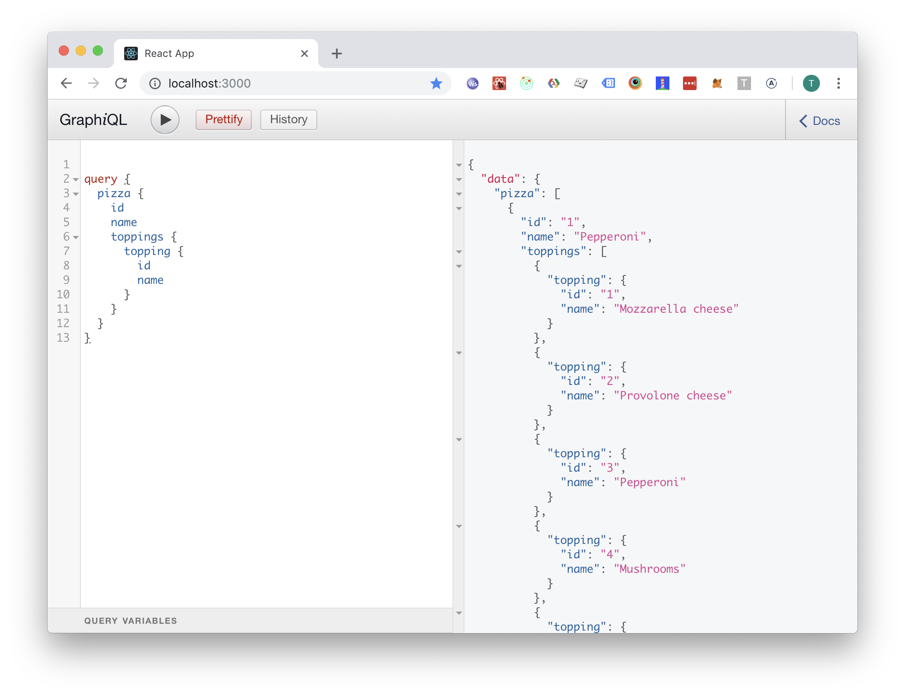

# Kickstart your GraphQL API with Hasura.

## TL;DR;

Hasura can accelerate backend development by automating the implementation of simple CRUD endpoints. Business logic can be implemented using remote schemas, webhooks and database triggers/functions.

## Introduction

In today's software world you need to balance between future proofing, features, quality and budget. In this post we are going to discuss how to kickstart your backend project into steep upwards trajectory without compromising too much on future maintainability of your system. We are going to find out how to dodge the CRUD boilerplate and still have a room to implement possibly complex business logic. Let's do this by implementing a backend system for a fictional pizzeria and discuss the results at the end.

## Pizza API implementation

Everyone loves pizza, so let's see how we can implement a backend system for a fictional pizzeria using Hasura, PostgreSQL, Auth0 and one Koa microservice.

The code found in this post can be also found from [here](https://github.com/Turee/kickstart-your-graphql-api-with-hasura). I will referer to files found in the repository later. If you want to run the code examples you will need [hasura cli](https://docs.hasura.io/1.0/graphql/manual/hasura-cli/index.html#installation), [docker](https://www.docker.com/) and [docker-compose](https://docs.docker.com/compose/) installed.

The requirements are as follows:

- Allow customers place orders.
- Allow customers to receive updates to their order.
- Employees must have a dashboard where they can see a list of all active orders. Dashboard must be real time.

Let's start by firing up the system found in the [docker-compose.yml](https://github.com/Turee/kickstart-your-graphql-api-with-hasura/blob/master/docker-compose.yml) .

### Database

Let's migrate the database found in the [migration file](https://github.com/Turee/kickstart-your-graphql-api-with-hasura/blob/master/migrations/1547751385993_initial-tables.up.sql):

```sql
CREATE TABLE topping (
    id BIGSERIAL PRIMARY KEY,
    name TEXT NOT NULL
);

CREATE TABLE pizza (
    id BIGSERIAL PRIMARY KEY,
    name TEXT NOT NULL,
    price MONEY NOT NULL
);

CREATE TABLE pizza_topping (
    id BIGSERIAL PRIMARY KEY,
    pizza_id BIGINT REFERENCES pizza(id),
    topping_id BIGINT REFERENCES topping(id)
);
CREATE INDEX ON pizza_topping(pizza_id);
CREATE INDEX ON pizza_topping(topping_id);

CREATE TABLE order_status (
    status TEXT PRIMARY KEY
);

INSERT INTO order_status (status) VALUES ('NEW');
INSERT INTO order_status (status) VALUES ('RECEIVED');
INSERT INTO order_status (status) VALUES ('IN_PROGRESS');
INSERT INTO order_status (status) VALUES ('READY');

CREATE TABLE "order" (
    id BIGSERIAL PRIMARY KEY,
    created_at TIMESTAMP NOT NULL DEFAULT NOW (),
    user_id TEXT NOT NULL,
    pizza JSONB NOT NULL,
    status TEXT NOT NULL REFERENCES order_status(status)
);
CREATE INDEX ON "order"(status);
```

Next we are going to apply migrations:

```
hasura migrate apply
```

### Hasura metadata

Next we are going to add some Hasura metadata using the Hasura console. First thing to do is to add tracking information for the tables by clicking "Add all":



Hasura just generated a GraphQL CRUD API for us with filtering, aggregation and paging support.

Next thing to do is to add relationship tracking information for each table:



When we are done modifying metadata, let's save it to our Git repository so we can transfer our configuration to a different environment in the future:

```
hasura metadata export
```

This generates a file (migrations/metadata.yaml) that contains all the metadata about the database. I like to add this file in the git with the related database migrations so we can easilly keep track of changes to the database using git.

We can later apply the metadata by (ie. when deploying the changes to a different environment):

```
hasura metadata apply
```

### Authentication

Let's use [Auth0](https://Auth0.com/) to get our user authentication/signup working quickly.

Hasura has an excellent [tutorial](https://docs.hasura.io/1.0/graphql/manual/guides/integrations/auth0-jwt.html) for setting up Auth0. But for the impatient below is the TL;DR; version of the tutorial:

1. Create auth0 account, tenant and application.
2. Use [this tool](https://hasura.io/jwt-config) to create a JWT config.
3. Pass the JWT config as environment variable `HASURA_GRAPHQL_JWT_SECRET` as seen in the [docker-compose.yml](https://github.com/Turee/kickstart-your-graphql-api-with-hasura/blob/master/docker-compose.yml) .

That was simple enough 😅.

### Authorization

Next we are going to implement some access control. We don't want to allow users modify other peoples orders for example, that would be bad. To do this we are going to use Hasura console to generate the required metadata for the authorization.

First, let's give the user permission to select his own orders. We will add a custom check that will validate that the `user_id` in the database row will match the `x-hasura-user-id` header.


Next, let's allow the user to select all pizzas and toppings (he probably want's to see a menu):




### Order service

We could allow the user to insert orders to the database and have Hasura to save the value of `x-hasura-user-id` header to order's `user_id` column and that would be it.

But in the real world we probably want to execute some business logic when the order is placed like sending emails, processing payments and such.

We are going to implement a simple NodeJS application which expose a single GraphQL mutation called `createOrder` and we are going to glue the schema to the Hasura schema using Hasura's "Remote Schemas" feature:



Now the NodeJS application will handle `createOrder` mutations and we have a place where we can implement all the business logic we want.

Source code for the NodeJS application can be found here: LINK_TO_THE_NODE_APP

## Trying it out

Let's add some pizzas:

```sql
INSERT INTO topping (id, name) VALUES (1, 'Mozzarella cheese');
INSERT INTO topping (id, name) VALUES (2, 'Provolone cheese');
INSERT INTO topping (id, name) VALUES (3, 'Pepperoni');
INSERT INTO topping (id, name) VALUES (4, 'Mushrooms');
INSERT INTO topping (id, name) VALUES (5, 'Marinara sauce');
SELECT setval('topping_id_seq', (SELECT max(id) FROM topping));

INSERT INTO pizza (id, name, price) VALUES (1, 'Pepperoni', 11);
INSERT INTO pizza (id, name, price) VALUES (2, 'Margherita', 9);
SELECT setval('pizza_id_seq', (SELECT max(id) FROM pizza));

INSERT INTO pizza_topping (pizza_id, topping_id) VALUES (1, 1);
INSERT INTO pizza_topping (pizza_id, topping_id) VALUES (1, 2);
INSERT INTO pizza_topping (pizza_id, topping_id) VALUES (1, 3);
INSERT INTO pizza_topping (pizza_id, topping_id) VALUES (1, 4);
INSERT INTO pizza_topping (pizza_id, topping_id) VALUES (1, 5);

INSERT INTO pizza_topping (pizza_id, topping_id) VALUES (2, 1);
INSERT INTO pizza_topping (pizza_id, topping_id) VALUES (2, 5);
```

Now we can list pizzas with following query (using user's credentials):



Insert orders and watch changes to them!

<a href="http://www.youtube.com/watch?feature=player_embedded&v=D5W2cyiaUSA" target="_blank"></a>

## Discussion

I have been kind of thinking about using a solution like Hasura to speed up the implementation of the backend. A big chunk of the backend implementation work is writing simple CRUD endpoints that we can easily generate with Hasura. This speed ups the implementation and allows more time to implement the actual business logic.

Hasura allows three methods to implement the business logic:

1.  **Database triggers and functions.** You can implement business logic at some level directly into the database. However, with this option you are limited to the pretty verbose [PL/pgSQL](https://en.wikipedia.org/wiki/PL/pgSQL) programming language by default.

    It seems that there are couple of programming language extension for Postgres: [plv8](https://github.com/plv8/plv8) V8 javascript engine, [pgmoon](https://github.com/leafo/pgmoon) and [PL/Java](https://tada.github.io/pljava/). These solutions will probably have their own limitations.

2.  **Webhook callbacks.** In Hasura, it's possible to add [webhooks](https://hasura.io/event-triggers) that react to database events. This allows you to do some async business logic like sending notifications and updating search indices, etc. You can even use [Hasura subscriptions](https://docs.hasura.io/1.0/graphql/manual/subscriptions/index.html) to listen for changes. This pattern would have worked with our pizza api as well: we could just have the client insert the "order" row with built in mutation and add a webhook trigger that calls an endpoint which processes the payment for the order, the changed state is pushed then to the client through the subscription.

3.  **GraphQL Schema Stitching.** This is what we used in the example. Implementing your own GraphQL mutations and queries allows for the most flexibility in your implementation, as you are implementing the actual endpoint that handles the API call.

Obviously, you don't need to stick with one of these solutions. You can combine them and use the solution that feels the least awkward.

## Conclusion

In my opinion Hasura definitely has it's uses in my future backend stacks. Nobody enjoys writing simple CRUD endpoints after all and i'm sure our clients will appreciate for not having to pay for work that can be automated. Automatic support for GraphQL subscriptions is pretty neat too, implementing real time apps becomes a breeze!

Share your experiences in working with CRUD generators like Hasura in the comment section!
